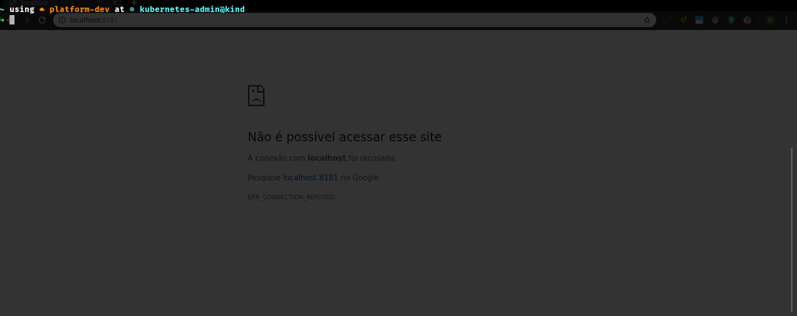

# KPF (Kube Port Forward)

## What is KPF?

KPF is a tool to assist in port redirects made through port-forward kubectl, keeping the current state and giving it a more refined control, being able to even save a state of several active redirects and restore them later, among other functions.



## Getting started

### Required dependencies

- [kubectl](https://kubernetes.io/docs/tasks/tools/install-kubectl/)
- [jq](https://stedolan.github.io/jq/)
- **gawk** (Linux distribution package)

### Install KPF

```sh
$ curl -L https://github.com/supermock/kpf/releases/download/v1.3.1/kpf -o /usr/local/bin/kpf
$ chmod +x /usr/local/bin/kpf
```

> **Note:** If you have installed the completions of kubectl and you are not able to access the kpf command, add to your bashrc or zshrc `unalias kpf`

### Some examples

Adding a port forward

```sh
# In this example I am adding a port forward to the Kubernetes Dashboard
$ kpf add kube-system k8s-app=kubernetes-dashboard 8443
```

Listing port forwards

```sh
$ kpf list
```

Removing a port forward

```sh
$ kpf del kube-system k8s-app=kubernetes-dashboard
```

Saving a current port forward state

```sh
$ kpf state save my-forwards
```

Restoring port forward from state

```sh
$ kpf state restore my-forwards
```

Update kpf to another version (Supported after 1.2.2)

```sh
$ kpf update 1.3.1
```

For more information, see the help...

## License

MIT
